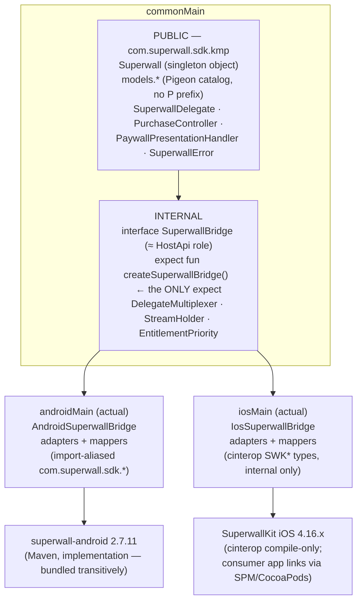

# Superwall KMP SDK — Implementation Plan

**Repo:** `/home/user/Superwall-KMP` · **Coordinates:** `com.superwall.sdk:superwall-kmp` · **Package:** `com.superwall.sdk.kmp`
**Toolchain (verified in repo):** Kotlin 2.3.10, AGP 9.0.1 (`com.android.kotlin.multiplatform.library`), Gradle 9.1.0, vanniktech maven-publish 0.36.0 · **Targets:** androidLibrary (minSdk 24 **provisional — see §4 minSdk note and Open Question #11**, compileSdk 36), iosArm64, iosSimulatorArm64, iosX64
**Native SDK pins:** `com.superwall.sdk:superwall-android:2.7.11` (verified at `/home/user/Superwall-Flutter/android/build.gradle:86`; the same file sets `minSdkVersion 26` at line 46 — see §4) · SuperwallKit iOS **4.16.x** (Flutter pins 4.14.2 in its podspec; take latest 4.16.x at spike time), min iOS 14
**API contract source of truth:** `/home/user/Superwall-Flutter/pigeons/configure.dart` (P-prefix stripped) · **Behavioral porting specs:** `/home/user/Superwall-Flutter/android/src/main/kotlin/com/superwall/superwallkit_flutter/*` and `/home/user/Superwall-Flutter/ios/Classes/*`

> This document merges three independent architecture proposals. Where they diverged, the resolution and its reasoning are recorded inline in *Resolved:* callouts.

---

## 1. Goals & non-goals

### Goals
- Ship a single KMP module exposing the **same external models and interfaces as the Flutter SDK's Pigeon definition**, without the `P` prefix, as hand-written commonMain Kotlin (no codegen). **Every deliberate deviation from the Pigeon contract is individually recorded and sign-off-gated** (governance in §3.4; ledger in `docs/MODELS.md`).
- Public API is **100% commonMain**: no cinterop type, no native SDK type, and no `ExperimentalForeignApi` ever appears in a public signature.
- Internally wrap **SuperwallKit Android** (androidMain) and **SuperwallKit iOS** (iosMain), playing exactly the role the Flutter plugin's native host classes play today.
- Idiomatic Kotlin async: `suspend` where the natives are async, synchronous properties where they are sync, `StateFlow`/`Flow` for the two event streams (replacing Pigeon EventChannels).
- **Fix, don't port, the known Flutter-layer bugs** (enumerated in §3.4).
- Identical `configure(apiKey, …)` signature on both platforms — no `Context` parameter (androidx.startup captures it).
- Publish to Maven Central via vanniktech; documented two-step iOS install (Gradle dep + SPM/CocoaPods pin) with a compatibility table.

### Non-goals (v1)
- **Static embedding of SuperwallKit/Superscript** into the Kotlin framework (RevenueCat-3.0 pattern) — explicit v2 milestone, not a v1 blocker.
- Swift-export ergonomics for Swift-first consumers (Kotlin Swift export is alpha; primary v1 consumers are Kotlin/Compose MP apps).
- A `SuperwallBuilder`-widget analog — `StateFlow` + Compose `collectAsState` covers it.
- Pre-configure call queuing (matches the Flutter SDK's deliberate choice; see §7).
- Exposing raw `ProductDetails` (Android) / `StoreProduct` (iOS) in the `PurchaseController` — candidate additive platform extension post-1.0.
- Porting Pigeon transport artifacts: the five `*Host` marker classes, hostId/messageChannelSuffix routing, `setDelegate(Boolean)`, `ignore: Boolean?` fields, `SubscriptionStatusType`, `TransactionProduct`, deprecated typedefs.

---

## 2. Architecture overview

### 2.1 Layer diagram



The `SuperwallBridge` interface plays exactly the role the Pigeon `PSuperwallHostApi` + the two native `SuperwallHost` classes play in the Flutter plugin — but it is an ordinary in-process Kotlin interface with real object references instead of hostId routing. The public `Superwall` object is a thin façade over it: default arguments, the pre-configure guard (with its exemption list, §7), delegate multiplexing, and stream ownership live in common code **once**, not per platform. `StreamHolder` **owns** the public flows in common code (they exist and are collectable before configure); platform bridges *attach* native sources to them at configure time (§4 "Stream wiring") — this is deliberately not a straight port, because the Flutter hosts only register their EventChannels during `configure`.

> **Resolved (bridge seam):** Proposals 1 & 2 used an `internal interface SuperwallBridge` + a single `internal expect fun createSuperwallBridge()`; Proposal 3 used `internal expect object SuperwallHost`. We take the **interface + factory**: an interface is mockable (`FakeBridge` contract tests for all façade logic in `commonTest`), avoids `expect object` restrictions (no supertypes on expects, awkward state), and keeps exactly one `expect` declaration in the whole module.

### 2.2 Source-set layout

```
superwall-kmp/
  build.gradle.kts                       # exists — extend: explicitApi(), deps, cinterop
  src/
    commonMain/kotlin/com/superwall/sdk/kmp/
      Superwall.kt                       # public singleton façade
      SuperwallDelegate.kt               # interface — ALL 15 methods default no-op
      PurchaseController.kt              # interface — 3 suspend methods
      PaywallPresentationHandler.kt      # mutable closure holder (builder-style setters)
      SuperwallError.kt                  # sealed exception hierarchy
      models/
        options/    SuperwallOptions.kt, PaywallOptions.kt, Logging.kt, RestoreFailed.kt,
                    OptionEnums.kt       # TestModeBehavior, NetworkEnvironment, LogLevel, LogScope,
                                         # TransactionBackgroundView, ConfigurationStatus, DeviceTier
        identity/   IdentityOptions.kt
        paywall/    PaywallInfo.kt, Product.kt, LocalNotification.kt, ComputedPropertyRequest.kt,
                    Survey.kt, PaywallEnums.kt   # FeatureGatingBehavior, PaywallCloseReason, ...
        store/      StoreProduct.kt, StoreTransaction.kt
        entitlements/ Entitlement.kt, Entitlements.kt, SubscriptionStatus.kt, CustomerInfo.kt,
                    EntitlementEnums.kt  # EntitlementType, ProductStore, LatestSubscriptionState/OfferType
        results/    PurchaseResult.kt, RestorationResult.kt, RestoreType.kt, TriggerResult.kt,
                    PresentationResult.kt, PaywallResult.kt, PaywallSkippedReason.kt,
                    PaywallPresentationRequestStatus.kt
        triggers/   Experiment.kt, Variant.kt, ConfirmedAssignment.kt
        redemption/ RedemptionResult.kt, RedemptionInfo.kt, Ownership.kt, StoreIdentifiers.kt,
                    PurchaserInfo.kt, ErrorInfo.kt, ExpiredCodeInfo.kt, RedemptionPaywallInfo.kt
        events/     SuperwallEventInfo.kt, EventType.kt, IntegrationAttribute.kt
        callbacks/  CustomCallback.kt, CustomCallbackResult.kt
      internal/
        SuperwallBridge.kt               # internal interface + internal expect fun createSuperwallBridge()
        DelegateMultiplexer.kt           # always-installed native delegate → user delegate + StateFlows
        StreamHolder.kt                  # common-owned MutableStateFlow/SharedFlow (seeded pre-configure,
                                         # native source attached at configure) + bridge CoroutineScope
        EntitlementPriority.kt           # Entitlement.mergePrioritized port (pure common logic)
    commonTest/kotlin/…                  # model tests, sealed exhaustiveness, mergePrioritized,
                                         # FakeBridge contract tests for the façade
    androidMain/kotlin/com/superwall/sdk/kmp/internal/
      SuperwallBridge.android.kt         # actual fun createSuperwallBridge() = AndroidSuperwallBridge
      AndroidSuperwallBridge.kt          # port of Flutter SuperwallHost.kt (minus Pigeon)
      SuperwallInitializer.kt            # androidx.startup Initializer<Unit>
      CurrentActivityTracker.kt          # ActivityLifecycleCallbacks → native ActivityProvider
      AndroidSetup.kt                    # public fun Superwall.androidSetup(app) escape hatch
      adapters/  DelegateAdapter.kt, PurchaseControllerAdapter.kt,
                 PresentationHandlerAdapter.kt, OnBackPressedAdapter.kt
      mappers/   OptionsMapper.kt, PaywallInfoMapper.kt, EventMapper.kt,
                 SubscriptionStatusMapper.kt, EntitlementMapper.kt, StoreMapper.kt,
                 ResultMappers.kt, RedemptionMapper.kt, AnySanitizer.kt
    androidMain/AndroidManifest.xml      # startup provider metadata
    androidMain/consumer-rules.pro       # R8 keep rules: SuperwallInitializer (reflective discovery)
    androidHostTest/  androidDeviceTest/ # already scaffolded by the AGP KMP plugin
    iosMain/kotlin/com/superwall/sdk/kmp/internal/
      SuperwallBridge.ios.kt             # actual fun createSuperwallBridge() = IosSuperwallBridge
      IosSuperwallBridge.kt              # Kotlin port of Flutter SuperwallHost.swift
      adapters/  DelegateAdapter.kt      # NSObject subclass : SuperwallDelegateObjc protocol
                 PurchaseControllerAdapter.kt   # : PurchaseControllerObjc protocol
                 PresentationHandlerAdapter.kt
      interop/   Continuations.kt        # completion-block → suspendCancellableCoroutine helpers
                 NSAnySanitizer.kt       # NSDictionary/NSArray/NSNumber ↔ Map<String, Any?>
      mappers/   (same file names as androidMain, mapping SWK* cinterop types)
    iosTest/kotlin/…                     # simulator: link smoke + mapper tests vs real SuperwallKit
    nativeInterop/cinterop/SuperwallKit.def
  sample/  androidApp/  iosApp/          # Compose MP demo; iosApp SPM-links SuperwallKit
  docs/    IMPLEMENTATION_PLAN.md, MODELS.md (Pigeon → KMP cross-reference + ratified Deltas table),
           ios-objc-gaps.md (gap matrix), COMPATIBILITY.md
```

**Build file additions:** `explicitApi()`; commonMain `api(kotlinx-coroutines-core)` (**`api`, not `implementation`** — `Flow`/`StateFlow` are in the public surface); androidMain deps per §4; per-target cinterop per §5. Enable kotlinx-binary-compatibility-validator before 1.0.

**Package/collision rule:** public code lives in `com.superwall.sdk.kmp` — deliberately disjoint from native Android's `com.superwall.sdk`. Only androidMain mapper/adapter files see both worlds, and they **must** import-alias every native type (`import com.superwall.sdk.models.entitlements.Entitlement as NativeEntitlement`). A Detekt/lint rule bans un-aliased `com.superwall.sdk.*` (non-`.kmp`) imports outside `internal/adapters` and `internal/mappers` — the collision hazard is chronic (nearly every stripped model name matches a native type), so it needs tooling, not just convention. iosMain interop names arrive `SWK`-prefixed; collisions are structurally impossible there.

---

## 3. Public API design

### 3.1 `Superwall` façade (representative signatures)

```kotlin
package com.superwall.sdk.kmp

public object Superwall {

    // ---- Configuration ---------------------------------------------------
    /** Identical signature on Android & iOS. No Context param: androidx.startup
     *  captures the Application on Android. Fire-and-forget; completion reports
     *  the configuration result. Android: superwall-android's configure completion
     *  carries Result<Unit> directly. iOS: native completion is a bare `(() -> Void)?`
     *  (verified: the Flutter host at SuperwallHost.swift:25-47 hardcodes success:true),
     *  so the bridge DERIVES the result — when the native completion fires, it reads
     *  Superwall.configurationStatus and maps .configured → success,
     *  .failed → failure(SuperwallError.ConfigurationFailed), .pending → treated as
     *  success-with-logged-warning (should not occur post-completion). An upstream
     *  request for a completion-with-result (or ObjC-visible failure reason) is on the
     *  Phase 1 upstream list (§5.3); until it lands, iOS failure detail is limited to
     *  the status enum. This asymmetry is documented in KDoc and COMPATIBILITY.md.
     *  Re-invocation: a second configure() call is a no-op that logs a warning via
     *  handleLog (matching both natives); the multiplexer install is idempotent (§7). */
    public fun configure(
        apiKey: String,
        purchaseController: PurchaseController? = null,
        options: SuperwallOptions? = null,
        completion: ((Result<Unit>) -> Unit)? = null,
    )
    /** Suspend twin — resumes when the native SDK reports configuration complete,
     *  with the same per-platform result derivation as configure's completion. */
    public suspend fun configureAndAwait(
        apiKey: String,
        purchaseController: PurchaseController? = null,
        options: SuperwallOptions? = null,
    )

    public var delegate: SuperwallDelegate?      // real object; null clears — no setDelegate(Boolean)
    public val configurationStatus: ConfigurationStatus   // guard-exempt (§7)
    public val isConfigured: Boolean                      // guard-exempt (§7)
    public val isInitialized: Boolean                     // guard-exempt (§7)
    public fun reset()

    // ---- Identity / attributes --------------------------------------------
    public val userId: String
    public val isLoggedIn: Boolean
    public fun identify(userId: String, options: IdentityOptions? = null)
    /** Snapshot getter. NOT symmetric with setUserAttributes — see below. */
    public val userAttributes: Map<String, Any?>
    /** MERGES into existing attributes (native semantics, both platforms): a null
     *  value REMOVES that key; absent keys are left untouched. This is deliberately
     *  a method, not a `var`, because set-then-get identity does not hold. */
    public fun setUserAttributes(attributes: Map<String, Any?>)
    public fun setIntegrationAttribute(attribute: IntegrationAttribute, value: String?)
    public fun setIntegrationAttributes(attributes: Map<IntegrationAttribute, String?>)
    public suspend fun getDeviceAttributes(): Map<String, Any?>
    public var localeIdentifier: String?
    public var logLevel: LogLevel                // enum end-to-end, not String

    // ---- Entitlements / subscription ---------------------------------------
    public val entitlements: Entitlements        // pure value snapshot — see §3.5 note
    /** Product-ID filtering is a façade call (it must reach the native SDK — the
     *  Flutter layer does this via a hidden nativeFilterCallback), NOT a method on
     *  the Entitlements value model; see §3.5 for the design decision. */
    public suspend fun getEntitlementsByProductIds(productIds: Set<String>): Set<Entitlement>
    public var subscriptionStatus: SubscriptionStatus            // synchronous get/set
    public val subscriptionStatusFlow: StateFlow<SubscriptionStatus>  // guard-exempt; seeded Unknown pre-configure (§4 stream wiring)
    public suspend fun getCustomerInfo(): CustomerInfo           // Android caveat: see §4
    public val customerInfoFlow: Flow<CustomerInfo>              // Android caveat: see §4
    public suspend fun confirmAllAssignments(): Set<ConfirmedAssignment>
    public suspend fun restorePurchases(): RestorationResult

    // ---- Presentation -------------------------------------------------------
    public fun register(                          // fire-and-forget, like both natives
        placement: String,
        params: Map<String, Any?>? = null,
        handler: PaywallPresentationHandler? = null,
        feature: (() -> Unit)? = null,
    )
    public suspend fun getPresentationResult(
        placement: String, params: Map<String, Any?>? = null,
    ): PresentationResult
    public suspend fun dismiss()
    public val isPaywallPresented: Boolean
    public val latestPaywallInfo: PaywallInfo?
    public fun preloadAllPaywalls()
    public fun preloadPaywalls(placementNames: Set<String>)
    public fun togglePaywallSpinner(isHidden: Boolean)
    /** Guard-EXEMPT (§7): both natives expose this as a static precisely so it can be
     *  called before/around configure — deep-link cold start is its primary use. */
    public fun handleDeepLink(url: String): Boolean
    public var overrideProductsByName: Map<String, String>?

    // ---- Platform-specific (documented no-op/echo on the other platform) ----
    public suspend fun consume(purchaseToken: String): String   // Play Billing; iOS echoes token
}
```

Ergonomic upgrade over Flutter: every native **sync** property (`userId`, `isLoggedIn`, `entitlements`, `logLevel`, `latestPaywallInfo`, …) is a direct property, not a `Future`; only genuinely-async natives are `suspend`.

> **Resolved (status naming):** `var subscriptionStatus` for sync get/set (matching both native SDKs) plus a distinctly-named `subscriptionStatusFlow: StateFlow` — avoids the property-vs-stream name collision Proposal 1 had, keeps Proposal 3's Compose-friendly shape.
> **Resolved (configure):** keep the fire-and-forget `configure` (Flutter/native parity) **and** add Proposal 1's `configureAndAwait` suspend twin — it is the sanctioned ordering tool given there is no pre-configure call queue.
> **Resolved (userAttributes):** getter property + `setUserAttributes` method with documented merge semantics — a symmetric `var` would misrepresent native behavior (set merges and null-removes; it does not replace), and the Pigeon contract itself models these as separate get/set methods.

### 3.2 Callback interfaces

```kotlin
/** ALL methods default no-op — users override selectively (fixes the Flutter
 *  inconsistency where only 4 of 15 had defaults).
 *  ANDROID AVAILABILITY CAVEAT: customerInfoDidChange and handleSuperwallDeepLink
 *  are declared in the common interface (Pigeon contract) but their Android wiring
 *  is UNVERIFIED — the Flutter Android host verifiably overrides neither (it
 *  implements only 13 of the 15 delegate methods; see §4 "Android delegate-hook
 *  audit"). Until the Phase 2 audit confirms superwall-android hooks exist, KDoc
 *  marks both as "@platform iOS (Android: pending upstream)". */
public interface SuperwallDelegate {
    public fun subscriptionStatusDidChange(from: SubscriptionStatus, to: SubscriptionStatus) {}
    public fun handleSuperwallEvent(eventInfo: SuperwallEventInfo) {}
    public fun handleCustomPaywallAction(name: String) {}
    public fun willPresentPaywall(paywallInfo: PaywallInfo) {}
    public fun didPresentPaywall(paywallInfo: PaywallInfo) {}
    public fun willDismissPaywall(paywallInfo: PaywallInfo) {}
    public fun didDismissPaywall(paywallInfo: PaywallInfo) {}
    public fun paywallWillOpenURL(url: String) {}
    public fun paywallWillOpenDeepLink(url: String) {}
    /** scope is the typed 22-value LogScope, not String (§3.4). Unmappable native
     *  level/scope strings fall back to LogLevel.DEBUG / LogScope.ALL with the raw
     *  string preserved under info["rawLevel"]/info["rawScope"] — degrade, never drop. */
    public fun handleLog(level: LogLevel, scope: LogScope, message: String?,
                         info: Map<String, Any?>?, error: String?) {}
    public fun willRedeemLink() {}
    public fun didRedeemLink(result: RedemptionResult) {}
    public fun handleSuperwallDeepLink(fullURL: String, pathComponents: List<String>,
                                       queryParameters: Map<String, String>) {}
    public fun customerInfoDidChange(from: CustomerInfo, to: CustomerInfo) {}
    public fun userAttributesDidChange(newAttributes: Map<String, Any?>) {}
}

/** One common interface covering both stores (mirrors the Flutter contract).
 *  Each platform bridge invokes only its store's method. */
public interface PurchaseController {
    public suspend fun purchaseFromAppStore(productId: String): PurchaseResult
    public suspend fun purchaseFromGooglePlay(
        productId: String, basePlanId: String?, offerId: String?,
    ): PurchaseResult
    public suspend fun restorePurchases(): RestorationResult
}

public class PaywallPresentationHandler {
    public fun onPresent(block: (PaywallInfo) -> Unit)
    public fun onDismiss(block: (PaywallInfo, PaywallResult) -> Unit)
    public fun onError(block: (String) -> Unit)
    public fun onSkip(block: (PaywallSkippedReason) -> Unit)
    /** The only value-returning callback; defaults to CustomCallbackResult.failure() when unset. */
    public fun onCustomCallback(block: suspend (CustomCallback) -> CustomCallbackResult)
}
```

### 3.3 Sealed-model conventions (pattern used everywhere)

```kotlin
public sealed interface SubscriptionStatus {
    public data class Active(val entitlements: Set<Entitlement>) : SubscriptionStatus
    public data object Inactive : SubscriptionStatus
    public data object Unknown  : SubscriptionStatus
    public val isActive: Boolean get() = this is Active
}

public sealed interface TriggerResult {
    public data object PlacementNotFound : TriggerResult
    public data object NoAudienceMatch   : TriggerResult
    public data class Paywall(val experiment: Experiment) : TriggerResult
    public data class Holdout(val experiment: Experiment) : TriggerResult
    public data class Error(val error: String) : TriggerResult  // nested → no kotlin.Error clash
}
```

Rules: `sealed interface` + nested subtypes; `data object` for empty cases (the Pigeon `ignore: Boolean?` hack disappears); generic names (`Active`, `Failed`, `Error`, `Unknown`, `Purchased`, `Device`, …) always nested inside their sealed parent (resolves stdlib collisions and matches native SDK style); Dart subtype-name prefixes dropped in favor of nesting (`RedemptionResult.Success`, `PaywallPresentationRequestStatusReason.Holdout`). Convenience factories match the Flutter public layer (`PurchaseResult.Failed`, `RestorationResult.Restored`, `CustomCallbackResult.success(data)`, `RestoreType.ViaPurchase(txn)` …). Document the Swift `.none` gotcha (`LogLevel.NONE`, `PaywallCloseReason.NONE`) in KDoc.

### 3.4 Deliberate deltas from the Flutter layer (all fidelity **fixes**, decided)

- `Experiment` carries its `variant: Variant` (Flutter's public type fakes an empty one).
- `TriggerResult` **and** `PaywallSkippedReason` are both sealed; `PaywallSkippedReason.Holdout(experiment)` keeps the payload Flutter drops.
- `SuperwallEventInfo` keeps the six silently-dropped fields (`userEnrichment`, `deviceEnrichment`, `message`, `integrationAttributes`, `reviewRequestedCount`, `missingProductIdentifiers`); `EventType` includes `paywallResourceLoadFail` (73 values); `attempt: Long?` stays numeric. **Platform-fidelity caveat (iOS):** this richness is only guaranteed on Android; on iOS the event payload's typed fields (`paywallInfo`, `transaction`, `product`, `result`, `survey`, `restoreType`, …) are Swift enum **associated values**, which are invisible via cinterop — whether `SuperwallDelegateObjc.handleSuperwallEvent` exposes them (vs. a flat event enum + params dictionary) is the **named Phase 1 gate item** (§5.3, §9). The common model keeps all fields; on iOS any field the ObjC boundary cannot deliver in v1 is null with the raw value available in `params`, and the gap goes on the upstream `@objc` PR list. The v1 fidelity decision (wait for upstream vs. ship params-fallback) is Open Question #12.
- Not replicated: the `"${placement}handler"` feature-hostId suffix mismatch, `ConfigureCompletionProxy` dropping the success bool, `transactionRestore` mislabeled as `transactionComplete`, dropped `type`/`product` on transaction events, `LocalNotification.id` hardcoded `""`/default-`0` (now required `String`), the OnBackPressed return-value/comment disagreement (semantics defined and tested explicitly).
- `logLevel` is the `LogLevel` enum end-to-end (wire API was stringly-typed). `handleLog` is **fully** typed: `scope` is the 22-value `LogScope` enum, not `String` (the enum already exists in the catalog — leaving scope stringly-typed was an oversight). Unmappable native level/scope strings degrade to `LogLevel.DEBUG` / `LogScope.ALL` with the raw string preserved in `info["rawLevel"]`/`info["rawScope"]` (consistent with the §7 degrade-never-crash rule).
- `Logging`'s client-side helpers are **ported, not dropped**: the Flutter public `Logging` carries `handleLogRecord` + `debug/info/warn/error` convenience methods (verified at `/home/user/Superwall-Flutter/lib/src/public/SuperwallOptions.dart:138-163`); the KMP `Logging` class keeps equivalents (`handleLogRecord(level, message, error?)` + the four level shorthands) so app-side log routing ports one-to-one.
- `enableExperimentalDeviceVariables` is actually wired (dead in Flutter).
- **Dates:** `kotlin.time.Instant` everywhere (stable in Kotlin 2.3 — no kotlinx-datetime dependency). *Resolved:* over Proposal 3's epoch-ms-Long-plus-accessors — one typed convention; mappers convert the Flutter codebase's epoch-ms (CustomerInfo family) and ISO-8601-string (StoreTransaction/StoreProduct) conventions at the boundary.
- **Set semantics** where set-like: `Entitlements.active/inactive/all/web`, `SubscriptionStatus.Active.entitlements`, `confirmAllAssignments()`, `preloadPaywalls`, `getEntitlementsByProductIds`.
- Options classes are non-null-with-defaults data classes (Flutter public style); `preloadDeviceOverrides: Map<DeviceTier, Boolean>` with a typed `DeviceTier` enum; `PaywallOptions.onBackPressed: ((PaywallInfo?) -> Boolean)?` as a real closure (Android-only, documented; threading in §6).
- Platform-only members stay in the common surface with KDoc `@platform` notes and documented no-op/echo semantics: `shouldBypassAppTransactionCheck`/`maxConfigRetryCount` iOS-only; `useMockReviews`/`preloadDeviceOverrides`/`onBackPressed`/`consume` Android-only; `customerInfoFlow`/`customerInfoDidChange`/`handleSuperwallDeepLink` pending the Android delegate-hook audit (§4).
- Untyped payloads are `Map<String, Any?>` with a documented value contract (String/Boolean/Long/Double/List/Map/Set); each platform ships an Any-sanitizer ported from `mapParamsForDart` (unknown → `toString()`, never crash).
- Pure client logic ports to commonMain: `Entitlement.mergePrioritized(Set<Entitlement>)` + priority comparator, `SubscriptionStatus.isActive`.

**Contract-deviation governance.** The task mandate is "same external models and interfaces as the Pigeon definition, minus P" — and this section deliberately violates it item by item (renames like `registerPlacement`→`register` and `preloadPaywallsForPlacements`→`preloadPaywalls`; type changes like epoch-`Long`→`Instant`, `List`→`Set`, `String` log level→enum; added fields like `Experiment.variant`; dropped models like `SubscriptionStatusType`/`TransactionProduct`). Each deviation is therefore **individually ledgered**: `docs/MODELS.md` gains a mandatory **Deltas table** — one row per deviation with columns {Pigeon shape, KMP shape, category (rename/type/add/drop), rationale, sign-off}. The table is the Phase 2 API-review artifact (Open Question #10): every row must carry an explicit approve/revert decision before Phase 2 exits, and Phase 2's validation criteria include "Deltas table complete and ratified" (see §9). Nothing ships under the generic label "fidelity fix" without a row.

### 3.5 Full model catalog (Pigeon → KMP, P stripped, grouped by area)

Maintained as `docs/MODELS.md` with a per-field cross-reference **plus the ratified Deltas table (§3.4)**; summary:

| Area | Models (data classes / sealed / enums) |
|---|---|
| **Configuration** | `SuperwallOptions`, `PaywallOptions`, `RestoreFailed`, `Logging` (incl. ported `handleLogRecord`/`debug/info/warn/error` helpers); enums `TestModeBehavior`, `NetworkEnvironment`, `LogLevel`, `LogScope` (22), `TransactionBackgroundView`, `ConfigurationStatus`, `DeviceTier` (typed key for `preloadDeviceOverrides`) |
| **Identity** | `IdentityOptions` |
| **Paywall** | `PaywallInfo` (~30 fields, all nullable), `Product`, `LocalNotification` + `LocalNotificationType`, `ComputedPropertyRequest` + `ComputedPropertyRequestType` (10), `Survey`, `SurveyOption`, `SurveyShowCondition`; enums `FeatureGatingBehavior`, `PaywallCloseReason` |
| **Store** | `StoreTransaction` (13 fields, dates → `Instant`), `StoreProduct` (41 fields, dates → `Instant`) |
| **Entitlements / customer** | `Entitlement` (13 fields), `Entitlements` (**pure value snapshot** — see note below), `CustomerInfo`, `SubscriptionTransaction`, `NonSubscriptionTransaction`; sealed `SubscriptionStatus` {`Active(Set<Entitlement>)`, `Inactive`, `Unknown`}; enums `EntitlementType`, `ProductStore`, `LatestSubscriptionState`, `LatestSubscriptionOfferType` |
| **Purchase/restore results** | sealed `PurchaseResult` {`Purchased`, `Cancelled`, `Pending`, `Failed(error)`}; sealed `RestorationResult` {`Restored`, `Failed(error)`}; sealed `RestoreType` {`ViaPurchase(StoreTransaction?)`, `ViaRestore`} |
| **Trigger / presentation** | `Experiment` (with `variant`), `Variant` + `VariantType`, `ConfirmedAssignment`; sealed `TriggerResult` (5 cases incl. nested `Error`); sealed `PresentationResult` (5 cases incl. `PaywallNotAvailable`); sealed `PaywallResult` {`Purchased(productId)`, `Declined`, `Restored`}; sealed `PaywallSkippedReason` {`Holdout(experiment)`, `NoAudienceMatch`, `PlacementNotFound`}; enum `PaywallPresentationRequestStatusType`; sealed `PaywallPresentationRequestStatusReason` (9 cases, nested, prefix-free) |
| **Redemption** | sealed `RedemptionResult` {`Success`, `Error`, `ExpiredCode`, `InvalidCode`, `ExpiredSubscription`}; `RedemptionInfo`, `PurchaserInfo`, `ErrorInfo`, `ExpiredCodeInfo`, `RedemptionPaywallInfo`; sealed `Ownership` {`AppUser`, `Device`}; sealed `StoreIdentifiers` {`Stripe`, `Paddle`, `Unknown`} |
| **Custom callbacks** | `CustomCallback`, `CustomCallbackResult` + `CustomCallbackResultStatus` |
| **Events** | `SuperwallEventInfo` (flat envelope, ALL fields — iOS fidelity caveat in §3.4), `EventType` (73 values), `IntegrationAttribute` (21 values) |
| **Dropped entirely** | `OnBackPressedHost`, `PurchaseControllerHost`, `ConfigureCompletionHost`, `PaywallPresentationHandlerHost`, `FeatureHandlerHost`, `ignore` fields, `SubscriptionStatusType`, `SuperwallBuilder`, `TransactionProduct`, deprecated typedefs |

> **Resolved (`Entitlements` vs. `byProductIds`):** `Entitlements` is a **pure immutable snapshot data class** (`active`/`inactive`/`all`/`web`) with value equality — it never carries a live bridge reference (which would break equality, snapshotting, and testability). Product-ID filtering — which must reach the native SDK (the Flutter layer does it via a hidden `nativeFilterCallback` for exactly this reason) — lives on the façade as `suspend fun Superwall.getEntitlementsByProductIds(productIds: Set<String>): Set<Entitlement>`, routed through the bridge. On Android this local-filters with a warning until upstream support exists (§4).

### 3.6 Internal bridge

```kotlin
internal interface SuperwallBridge {
    fun configure(apiKey: String, purchaseController: PurchaseController?,
                  options: SuperwallOptions?, completion: (Result<Unit>) -> Unit)
    fun setDelegate(delegate: DelegateMultiplexer?)   // multiplexer, installed once (idempotent — §7)
    fun register(placement: String, params: Map<String, Any?>?,
                 handler: PaywallPresentationHandler?, feature: (() -> Unit)?)
    suspend fun getPresentationResult(placement: String, params: Map<String, Any?>?): PresentationResult
    fun setUserAttributes(attributes: Map<String, Any?>)   // merge semantics (§3.1)
    suspend fun getEntitlementsByProductIds(productIds: Set<String>): Set<Entitlement>
    fun attachStreams(holder: StreamHolder)   // called once at configure-complete (§4 stream wiring)
    // … one member per façade member (~40 total, mirroring the Pigeon HostApi),
    // taking/returning ONLY commonMain model types
}
internal expect fun createSuperwallBridge(): SuperwallBridge
```

The façade owns: the `DelegateMultiplexer` (installed into the native SDK exactly once at configure, idempotently on repeat configure calls; forwards to the user `delegate` if set **and** feeds the flows — fixing Flutter's `setDelegate(bool)` artifact and stream re-wrap quirk), the user `PurchaseController` reference, the `StreamHolder` (flows exist pre-configure; §4), and the pre-configure guard **with its exemption list** (§7).

---

## 4. Android implementation strategy

**Dependencies (androidMain):** `implementation("com.superwall.sdk:superwall-android:2.7.11")` — **`implementation`, never `api`**: native types stay hidden; the dependency still propagates through published module metadata so consumers add nothing. Plus `androidx.startup:startup-runtime`, `kotlinx-coroutines-android`.

**minSdk (Phase 0 gate).** The KMP scaffold sets `android-minSdk = 24` (`/home/user/Superwall-KMP/gradle/libs.versions.toml:4`), but the Flutter plugin builds against superwall-android 2.7.11 with `minSdkVersion 26` (`/home/user/Superwall-Flutter/android/build.gradle:46`; the Flutter repo's CLAUDE.md also states min SDK 26). If the superwall-android AAR declares `minSdk > 24`, every consumer at minSdk 24–25 hits a manifest-merger failure. Phase 0 therefore **inspects the AAR's `AndroidManifest.xml` `uses-sdk` declaration and builds the consumer fixture at minSdk 24 explicitly**; if the merge fails, the module moves to minSdk 26 (preferred over `tools:overrideLibrary`, which merely hides the incompatibility) — decision recorded as Open Question #11 and resolved before any other Android work.

**Context/Activity (replaces the Flutter plugin lifecycle):**
- `SuperwallInitializer : androidx.startup.Initializer<Unit>` (declared in the library manifest) captures the `Application` and calls `registerActivityLifecycleCallbacks(CurrentActivityTracker)` (WeakReference to the resumed Activity).
- `AndroidSuperwallBridge.configure` calls static `NativeSuperwall.configure(application, apiKey, mappedOptions, purchaseControllerAdapter, ActivityProvider { CurrentActivityTracker.current }, completion)` — the same shape as `SuperwallHost.kt`, minus Pigeon. So common `configure(apiKey, …)` needs no Context.
- Escape hatch for apps that strip startup initializers: `public fun Superwall.androidSetup(application: Application)` — the one intentional platform-specific public function (androidMain extension).
- **Failure mode when androidx.startup is stripped** (common with WorkManager `InitializationProvider` removal): `configure()` on Android checks whether an `Application` was captured; if not, it fails **immediately and actionably** with `SuperwallError.NotInitialized("Superwall's androidx.startup initializer did not run — call Superwall.androidSetup(application) from Application.onCreate()")` instead of proceeding with no `Application`/`ActivityProvider` and crashing later inside the native SDK. Covered by a Robolectric test that disables the provider (Phase 2 validation). The module ships `consumer-rules.pro` keeping `SuperwallInitializer` (androidx.startup discovers initializers reflectively; R8 full mode can strip them), and the README documents both the keep rule and the `tools:node="remove"` pitfall.

**Method mapping:** near-mechanical port of `/home/user/Superwall-Flutter/android/.../SuperwallHost.kt`:
- Sync property passthroughs stay synchronous (`logLevel`, `userId`, `isLoggedIn`, `localeIdentifier`, `overrideProductsByName`, `latestPaywallInfo`, `entitlements`, `configurationState`, extension-function APIs `identify`/`setUserAttributes`/`register`).
- Native suspend + `Result<T>` APIs (`confirmAllAssignments`, `getPresentationResult`, `restorePurchases`, `consume`, `dismiss`, `deviceAttributes`) are called directly from the KMP suspend functions — the caller's coroutine suspends; no IO-scope + callback dance. Wrap in `withContext(Dispatchers.IO)` only where the native call is not documented main-safe (default: keep the Flutter host's IO hop as the conservative default and remove per-call once verified). Failures → thrown `SuperwallError.Native(cause)` except where the domain type already models failure.

**Stream wiring (deliberately NOT a straight port — the one façade feature the Flutter host cannot supply a pattern for, since it only registers EventChannels during `configure`):**
- `StreamHolder` (commonMain) owns `MutableStateFlow<SubscriptionStatus>(Unknown)` and a `MutableSharedFlow<CustomerInfo>` from module init; the façade exposes `.asStateFlow()`/`.asSharedFlow()` — so `subscriptionStatusFlow` is collectable (emitting `Unknown`) before configure, with **no** eager `stateIn` over a native source that does not yet exist (`Superwall.instance.subscriptionStatus` **throws** before configure — the naive `stateIn(bridgeScope, Eagerly, …)` design was wrong).
- At configure-complete, `bridge.attachStreams(holder)` performs the lazy attach: Android launches a collector on `Superwall.instance.subscriptionStatus.map { it.toKmp() }` writing into the holder's `MutableStateFlow`, plus an initial sync read to close the seed gap; iOS does the equivalent from delegate callbacks + initial sync getter (§5.3). Attach is idempotent (repeat configure re-uses the existing collector). FakeBridge contract tests cover: pre-configure `Unknown`, seed-to-real transition at attach, and no duplicate collectors on double configure.
- `customerInfoFlow` — **Android source unverified; see the delegate-hook audit below.**

**Android delegate-hook audit (Phase 2, blocking for three surface members).** The Flutter Android `SuperwallDelegateHost.kt` verifiably overrides only 13 of the 15 delegate methods — **neither `customerInfoDidChange` nor `handleSuperwallDeepLink`** — and `SuperwallHost.kt:80` extends only `StreamSubscriptionStatusStreamHandler`; the `streamCustomerInfo` EventChannel is **never registered on Android**. There is no evidence superwall-android 2.7.11's `SuperwallDelegate` even has these hooks. Phase 2 therefore audits the superwall-android 2.7.11 delegate interface directly: if the hooks exist, `DelegateAdapter` wires them and `customerInfoFlow` is fed from `customerInfoDidChange` into the holder's `MutableSharedFlow`; if they do not, then `customerInfoFlow` (empty on Android), `customerInfoDidChange`, and `handleSuperwallDeepLink` join the documented Android platform-gap list below (KDoc `@platform iOS`, `handleLog` warning on first collection/registration), with upstream superwall-android issues filed alongside `getCustomerInfo`. Until the audit lands they are presented as **pending**, not working.

**Adapters:** `DelegateAdapter` implements native `com.superwall.sdk.delegate.SuperwallDelegate`, maps payloads, forwards to the multiplexer on `Dispatchers.Main`. `PurchaseControllerAdapter` implements the native `PurchaseController`; its `purchase(activity, productDetails, basePlanId, offerId)` extracts `productDetails.productId` and calls the user's `suspend purchaseFromGooglePlay(...)` **directly** — both sides are coroutines, no `suspendCoroutine` shim (unlike the Flutter host). `PresentationHandlerAdapter` builds a native `PaywallPresentationHandler` whose closures forward to the common handler; `onCustomCallback` awaits the user's suspend lambda. `OnBackPressedAdapter` invokes the user's `onBackPressed` closure **synchronously on the invoking thread** (§6 exception).

**Known native gaps, surfaced honestly (documented per-field in KDoc; upstream superwall-android issues filed in the parity phase):**
- `getCustomerInfo()` — synthesized minimal `CustomerInfo(userId = …)` with empty lists (Flutter parity). *Resolved:* keep the synthesized stub as default rather than Proposal 2's throw — throwing would break common code paths that work on iOS; log a `handleLog` warning on every call. Escalated as Open Question #1 (product call).
- `customerInfoFlow` / `customerInfoDidChange` / `handleSuperwallDeepLink` — **pending the delegate-hook audit above**; if superwall-android lacks the hooks: no emissions/invocations on Android, logged warning, upstream issue.
- `getEntitlementsByProductIds` — local-filter fallback + warning (Android `Entitlement` carries only id/type).
- `StoreProduct.subscriptionGroupIdentifier`/`isFamilyShareable` — null/false; `Entitlement.type` always `SERVICE_LEVEL`.

**Threading:** delegate/handler/feature callbacks → `Dispatchers.Main`; `onBackPressed` synchronous same-thread (§6); suspend bridging per the common contract in §6.

---

## 5. iOS implementation strategy

### 5.1 Decision: direct cinterop against SuperwallKit's ObjC surface, compile-only; consumer app links SuperwallKit (RevenueCat pre-3.0 pattern)

All three proposals independently selected this option (Option B of the interop brief). Rationale:
- SuperwallKit's ObjC layer is **first-class and maintained**: 58 files carry `@objc(SWK…)`, plus dedicated adapters for every Swift-only construct (`SuperwallDelegateObjc`/`objcDelegate`, `PurchaseControllerObjc`, `SubscriptionStatusObjc`, `RedemptionResultObjc`, `RestorationResultObjc`, `GetPaywallResultObjc`, `StoreProductAdapterObjc`). Kotlin/Native cinterop parses ObjC headers only (no Swift import exists in Kotlin 2.3.x), so this layer **is** the boundary.
- The Superscript Rust `libcel.xcframework` transitive dependency resolves automatically through the consumer's SPM/CocoaPods — the hardest linking problem is delegated to Apple tooling.
- Rejected: **Kotlin CocoaPods plugin** (pod deps don't propagate through Maven publication → forces CocoaPods + the plugin on every consumer); **runtime injection** (re-ships the host layer as user code); **static embedding now** (right end-state, wrong first step — it also requires folding in Superscript's binary slices and a Swift toolchain in publish CI). Static embedding is the explicit **v2 fallback/end-state** if version-lock support burden proves too high — the same trajectory RevenueCat followed. CocoaPods-plugin and pulled-forward static embedding remain the ordered **no-go fallbacks** for the Phase 1 gate (§9).

### 5.2 Mechanics

- `nativeInterop/cinterop/SuperwallKit.def`: `language = Objective-C`, `modules = SuperwallKit`, generated-bindings package `com.superwall.sdk.kmp.internal.ios.interop`. Headers come from the generated `SuperwallKit-Swift.h` inside a `SuperwallKit.xcframework` built in CI via Superwall-iOS `make-xcframework.sh` (request an `SuperwallKit.xcframework.zip` release asset upstream immediately — a one-line CI change that makes clean-machine builds reproducible). A checksum-verified `downloadSuperwallKitXCFramework` Gradle task unpacks per-target slices (`ios-arm64` device; `ios-arm64_x86_64-simulator` for both simulator targets) and wires `compilerOpts("-F…", "-framework", "SuperwallKit")` per target.
- The klib carries **bindings only, no binary**. All cinterop types stay `internal`; no `export()`; `@OptIn(ExperimentalForeignApi::class)` confined to iosMain — consumers never see ObjC types.
- **Version pin:** `SUPERWALLKIT_IOS_VERSION` constant (4.16.x at spike time) stamped into the POM, README compatibility table, and a **runtime assertion in `configure()`** comparing the linked SuperwallKit's reported version string against the compiled-against pin (hard log warning on mismatch — a mismatch is otherwise a runtime unrecognized-selector crash, not a compile error).
- **`configure` completion result derivation (designed, not assumed):** native `Superwall.configure(...completion:)` takes a bare `(() -> Void)?` — verified at `/home/user/Superwall-Flutter/ios/Classes/SuperwallHost.swift:25-47`, where the Flutter host hardcodes `success: true`. The KMP bridge cannot receive a result, so it derives one: when the native completion fires, read the ObjC-visible `configurationStatus` and map `.configured → Result.success(Unit)`, `.failed → Result.failure(SuperwallError.ConfigurationFailed("SuperwallKit reported configurationStatus == failed"))`, `.pending → success + logged warning` (should not occur post-completion; treated as success to avoid false negatives). This derivation backs both `configure`'s completion and `configureAndAwait` on iOS. A richer upstream API — completion-with-result or an ObjC-visible failure reason — is on the Phase 1 upstream request list (§5.3); the asymmetry vs. Android (whose native completion carries `Result<Unit>` directly) is documented in KDoc and `COMPATIBILITY.md`.

### 5.3 Boundary routing rules (what cannot cross Swift → ObjC → Kotlin)

| Shape | Examples | Routing |
|---|---|---|
| Swift enum w/ associated values | `SubscriptionStatus`, `RedemptionResult`, `PaywallResult`, `PresentationResult`, `TriggerResult`, `PurchaseResult`, `RestorationResult`, `RestoreType`, `PaywallSkippedReason` | Shipped `*Objc` adapters; missing ones → upstream `@objc` PR |
| **`SuperwallEvent` associated values (the single largest payload in the SDK — named Phase 1 gate item)** | the ~70-case event enum's typed payloads: `paywallInfo`, `transaction`, `product`, `result`, `survey`, `restoreType`, `attempt`, … — the Flutter `SuperwallDelegateHost.swift` switch **destructures Swift associated values**, which cinterop cannot see | Phase 1 determines exactly what `SuperwallDelegateObjc.handleSuperwallEvent` delivers (expected: flat event enum + params dictionary). Whatever is missing becomes a dedicated upstream workstream — an `@objc` event-info envelope exposing the typed payloads — sized in the gap matrix as its own line item, **not** lumped into the four "expected candidates" below. Interim v1 route: flat enum + sanitized `params`, typed fields null (§3.4 caveat, Open Question #12) |
| Swift structs / non-`@objc` types | any struct-typed model | Must have an `@objc(SWK…)` twin; spike enumerates |
| `async`-only funcs | `getCustomerInfo`, `getDeviceAttributes`, `confirmAllAssignments`, `dismiss` | `@objc` async exports as completion-handler → `suspendCancellableCoroutine`; async-only-Swift gaps get upstream completion variants |
| Bare `(() -> Void)` completions | `configure(...completion:)` | Result derived from post-completion `configurationStatus` (§5.2); upstream completion-with-result requested |
| Combine / AsyncSequence | `$subscriptionStatus`, `customerInfoStream` | Never crosses; feed the common `StreamHolder` flows from ObjC delegate callbacks + initial sync getter at `attachStreams` (§4 stream wiring) |
| Generics / `Set<T>` | `Set<Entitlement>` → untyped `NSSet` | Element-wise casts in mappers |
| Default args | `register` overloads | Call fullest explicit overload; defaults live in commonMain |
| Optional primitives | `maxConfigRetryCount: Int?` | `NSNumber?` + sanitizer (objCType-based bool/int/double disambiguation) |
| Swift `Error`/`throws` | `PurchaseResult.failed(Error)` | `NSError` → `String`/`SuperwallError` at the mapper (Pigeon already stringifies) |
| Protocol default impls | optional delegate methods | Kotlin implements the full ObjC protocol; user optionality = common interface defaults |

**Gap protocol:** the interop spike (Phase 1) walks every `SuperwallBridge` member against the generated `SuperwallKit-Swift.h` and emits a **gap matrix** (`docs/ios-objc-gaps.md`): each row marked {ObjC-visible | route via `*Objc` adapter | missing upstream}. Two rows are pre-declared **named gate items** because they gate headline plan claims: (1) `SuperwallEvent` associated-value reachability (see table row above), (2) `configure` failure signaling (§5.2). Every "missing" row becomes an upstream `@objc` PR to Superwall-iOS (Superwall owns the repo, so the boundary is negotiable — but this couples KMP releases to iOS SDK releases and must be scheduled before parity work). Expected candidates beyond the two gate items: typed `setIntegrationAttributes`, `customerInfoStream` (fallback: delegate-fed SharedFlow), `handleSuperwallDeepLink`, `overrideProductsByName`. A CI **header-audit script** diffs the header against the required list on every SuperwallKit bump.

**Adapters:** `DelegateAdapter : NSObject(), <SuperwallDelegateObjc protocol>` assigned to `Superwall.objcDelegate`, forwarding on `Dispatchers.Main`; the `handleSuperwallEvent` mapping ports the event-name/params logic from `SuperwallDelegateHost.swift` with the mislabels fixed — but its typed-payload fidelity is bounded by the gate item above, since the Swift switch's associated-value destructuring cannot be ported through cinterop. `PurchaseControllerAdapter` implements `PurchaseControllerObjc` — its completion-handler methods `launch` on the bridge scope and call the user's suspend impl, **never blocking the main queue** (SuperwallKit invokes these `@MainActor`; blocking = deadlock — covered by an on-device test). No view-controller plumbing is needed: the Flutter iOS host has zero `UIViewController` references — SuperwallKit resolves the presenter itself.

### 5.4 What consumers must add (v1)

- **commonMain/Gradle:** `implementation("com.superwall.sdk:superwall-kmp:x.y.z")` — that's all for Android.
- **iOS app:** add `SuperwallKit` via **SPM (preferred) or CocoaPods**, exact-pinned to the version in the release's compatibility table; build the Kotlin framework with `isStatic = true`. Superscript resolves transitively. Two documented steps total.
- **v2 removes the iOS step entirely** via static embedding (RevenueCat-3.0 pattern: Superwall-iOS CI publishes a static SuperwallKit+libcel bundle; superwall-kmp `-include-binary`s the slices).

---

## 6. Callback surfaces & threading rules (enforced in commonMain, documented on every interface)

1. **Delivery:** every SDK→app callback — delegate methods, presentation-handler closures, `feature` lambdas, `configure` completion, Flow emissions — is dispatched on **`Dispatchers.Main.immediate`**. **Sole exception — `onBackPressed` (Android):** the native hook is a *synchronous* `(PaywallInfo?) -> Boolean` whose return value must be produced on the invoking thread (shape verified in `OnBackPressedHost.kt:17-25`), so async dispatch is impossible; the user's closure is invoked **synchronously on the thread the native SDK calls it on** — the main thread, since it is driven by the paywall Activity's back handling; the adapter asserts main-thread in debug builds and the exception is documented on `PaywallOptions.onBackPressed` KDoc ("keep it fast and non-blocking; do not suspend or hop dispatchers").
2. **Main-safety:** all public `suspend` functions are callable from any dispatcher, including Main; bridges hop internally where needed (Android: IO around non-main-safe native suspends; iOS: continuation resumption off the completion queue).
3. **App→SDK suspend callbacks** (`PurchaseController.*`, `onCustomCallback`) run in one internal `CoroutineScope(SupervisorJob() + Dispatchers.Main.immediate)` per bridge (in `StreamHolder.kt`); the user's implementation may switch dispatchers freely. The iOS purchase-controller bridge **must launch, never `runBlocking`** — SuperwallKit calls it on the main actor.
4. **Handler lifetime:** each `register` call creates a fresh adapter that strongly retains its `handler`/`feature`; the adapter is retained Kotlin-side (critical on iOS — never rely on ObjC retaining Kotlin-implemented objects; SuperwallKit's delegate may be weak). Release semantics: the iOS Flutter host verifiably cleans up **only on `onDismiss` and `onSkip`** (`SuperwallHost.swift:299` + `ios/Classes/PaywallPresentationHandler.swift` — `onError` at line 50 performs no cleanup), so "release on error" is **not** a mirror of the host pattern. We adopt it anyway as a **declared deliberate behavior** (Deltas-table row): when a presentation errors, no paywall was presented, so no dismiss/skip will ever arrive and the never-released adapter is a leak in the Flutter host. Phase 1's spike verifies empirically whether SuperwallKit can emit further handler callbacks after `onError`; if it can, release stays dismiss/skip-only with bounded retention accepted and documented — the go/no-go on error-terminality is a Phase 1 output, tested either way (post-error callback delivery test in Phase 4). *Resolved:* per-registration adapters (Proposal 1) instead of a placement-keyed registry (Proposals 2/3) — direct object references make placement keying unnecessary and it was the source of the Flutter one-handler-per-placement aliasing bug.
5. **Exception safety:** user-callback exceptions are caught by adapters, logged via `handleLog`, and mapped to domain failures (`PurchaseResult.Failed(message)`, `CustomCallbackResult.failure()`); they never propagate into native SDK internals and never kill the supervisor scope. (For the synchronous `onBackPressed`, a thrown exception is caught, logged, and treated as `false` — "don't intercept".)
6. `register` is fire-and-forget (sync), matching both natives.

---

## 7. Error handling & result types

```kotlin
public sealed class SuperwallError(message: String?, cause: Throwable? = null)
    : Exception(message, cause) {
    public class NotConfigured : SuperwallError("Superwall.configure must be called first")
    public class NotInitialized(message: String) : SuperwallError(message)   // Android startup-stripped case (§4)
    public class NotSupportedOnPlatform(api: String, platform: String) : SuperwallError(…)
    public class ConfigurationFailed(message: String?) : SuperwallError(message)
    public class Native(message: String?, cause: Throwable? = null) : SuperwallError(message, cause)
}
```

> **Resolved:** sealed hierarchy (Proposals 2/3) over Proposal 1's single class — richer diagnostics at no API cost; still the *only* exception family thrown by public suspend functions.

- **Domain outcomes never throw** — they stay in the sealed result types (`PurchaseResult.Failed`, `RestorationResult.Failed`, `TriggerResult.Error`, `RedemptionResult.Error`, handler `onError(String)`).
- **Infrastructure failures throw `SuperwallError`**: Android wraps `kotlin.Result` failures; iOS wraps `NSError` (domain/code/localizedDescription preserved in the message).
- `configure` completion delivers `Result<Unit>` on **real** configuration completion. Android: the native completion carries `Result<Unit>` directly (fixes the dropped success bool). iOS: the native completion is a bare `(() -> Void)?`, so the result is **derived** from post-completion `configurationStatus` per §5.2 (fixes the Flutter host's fire-immediately-with-hardcoded-success quirk, within the limits of the current native API; upstream completion-with-result requested).
- **`configure` re-invocation semantics:** a second `configure()` call after a successful (or in-flight) first is a **no-op** — the completion is invoked with `Result.success` immediately (or queued behind the in-flight completion), a `handleLog` warning is emitted, and no options/controller/multiplexer re-install occurs (matching both natives' ignore-second-configure behavior; the multiplexer install is idempotent). Covered by a FakeBridge contract test.
- **Pre-configure access:** no call queue (Flutter's deliberate choice), but a **common guard in the façade** throws `SuperwallError.NotConfigured` consistently on both platforms. **Guard exemption list (explicit, tested):** `configure`/`configureAndAwait` (obviously), **`handleDeepLink`** — both natives expose it as a *static* precisely so it works before/around configure; deep-link cold start is its primary use and a blanket guard would break it — plus the introspection members `isConfigured`, `isInitialized`, `configurationStatus`, and the stream accessors `subscriptionStatusFlow`/`customerInfoFlow` (they return the common-owned, pre-seeded flows from `StreamHolder`; §4). Setting `delegate` pre-configure is also allowed (stored; installed at configure). Everything else guards. The exemption list is enumerated in one place (`Superwall.kt`) and exhaustively covered by FakeBridge contract tests. *Resolved:* Proposal 1's guard wins over "let native behavior leak" (Proposals 2/3) — native behavior diverges (Android's `Superwall.instance` throws, iOS may not), and platform-divergent crashes are the worst outcome. `configureAndAwait` is the sanctioned ordering tool; `isConfigured`/`configurationStatus` allow gating.
- **Mapping failures degrade, never crash** (forward-compat for version skew, inherent to the compile-only iOS binding): unknown native enum case → documented fallback (`SubscriptionStatus.Unknown`, `ConfigurationStatus.FAILED`, `LogLevel.DEBUG`/`LogScope.ALL` with raw string preserved per §3.4) + `handleLog` warning; unknown payload values → `toString()`.

---

## 8. Testing & example app strategy

| Layer | What | Where |
|---|---|---|
| commonTest | Model defaults, sealed exhaustiveness, `mergePrioritized` (port Dart tests), `FakeBridge` contract tests for all façade logic (guard **+ full exemption list incl. pre-configure `handleDeepLink`**, configure re-invocation no-op, multiplexer idempotence, stream seeding + attach transition + no-duplicate-collector, handler retention), Flow tests with virtual time | every phase |
| androidHostTest (JVM) | Mapper round-trips against **real native classes** (they don't need a device), options/status/event/redemption mappers, Robolectric initializer test **+ startup-stripped test (provider disabled → `configure` throws actionable `NotInitialized`)** | Phase 2+ |
| androidDeviceTest | configure-with-bad-key → `configurationStatus == FAILED` **and completion delivers `Result.failure`**, activity-tracker instrumentation, register smoke vs `com.superwall.superapp` | Phase 2+ |
| iosSimulatorArm64Test | Link smoke (instantiate SWK classes), mapper tests against real SuperwallKit types, `NSAnySanitizer` tests (NSNumber bool/int/double ambiguity gets dedicated cases), continuation bridging, **configure-result derivation (bad key → derived `ConfigurationFailed`)**. If SuperwallKit hard-requires network at configure, deep behavior moves to the sample-app UI layer | Phase 3+ |
| On-device integration | Purchase-controller **main-actor re-entrancy/deadlock** test (StoreKit test session / Play sandbox), `onCustomCallback` round-trip, stream initial-value + transition coverage, **post-`onError` handler behavior (error-terminality verification per §6.4)** | Phase 4 |
| Sample app | `sample/` Compose Multiplatform demo (androidApp + iosApp with SPM-linked SuperwallKit): Configure / Identify / Register buttons, status label bound to `subscriptionStatusFlow`; grows to mirror the Flutter `test_app` scenario list; Maestro (Android) + XCUITest (iOS) flows ported from `test_app/maestro/` | Phase 3+ |

**CI (steady state):**
- **PR (~10 min):** Linux — ktlint/Detekt (incl. the alias-import rule), commonTest, androidHostTest, `assembleAndroid`; macOS — compile all three iOS targets, iosSimulatorArm64Test, cinterop **header-audit diff**, `publishToMavenLocal` + consumer-fixture build **at the module's declared minSdk** (validates AGP-9 KMP-library metadata + transitive superwall-android **+ minSdk manifest-merge compatibility** — do this from Phase 0, not at release).
- **Nightly / opt-in label:** managed-device Android instrumentation, iOS simulator UI tests + Maestro, sample-app release builds.
- **Release:** runs on a **macOS runner** — this is a hard requirement, not an optimization: `publishToMavenCentral` for a KMP module with iOS targets must compile the iOS klibs, and the cinterop step needs the `SuperwallKit.xcframework` present, so the release job depends on `downloadSuperwallKitXCFramework` (checksum-verified; cache keyed by (SuperwallKit version, Xcode version)) before publish. Pipeline: binary-compat check → macOS `publishToMavenCentral` (tag-driven) → compatibility-table entry; pins stamped into POM + `SuperwallVersions.kt`. **Kotlin-compiler compatibility:** cinterop-bearing klibs pin consumers to a compatible Kotlin compiler range (klib ABI); `COMPATIBILITY.md` therefore carries a **supported consumer Kotlin version range column** per release (initially: the Kotlin version we build with plus the forward-compatibility window the klib ABI guarantees), alongside the superwall-android and SuperwallKit-iOS pins, and the release checklist re-verifies it on every Kotlin bump.
- **Cross-repo canary:** scheduled job building against latest Superwall-iOS `main` XCFramework + latest superwall-android, catching upstream drift before release day.

---

## 9. Phased milestones

> **Resolved (sequencing):** merges Proposal 2's *spike-first go/no-go gate* (the iOS ObjC gap matrix is the #1 unknown and must precede surface-area work) with Proposal 3's *vertical-slice* insight (prove the whole pipeline — cinterop, adapters, Activity plumbing, both callback directions, main-thread dispatch — with one thin end-to-end feature before breadth). Proposal 1's linear Android-then-iOS ordering was rejected: it defers the riskiest work.

### Phase 0 — Toolchain proof (~2–3 days)
Extend the existing scaffold: `explicitApi()`, `api(kotlinx-coroutines-core)`, androidMain deps, empty `SuperwallBridge` + stub actuals compiling on all four targets, `publishToMavenLocal`, consumer-fixture project. **minSdk gate:** inspect the superwall-android 2.7.11 AAR's declared `minSdk` and build the consumer fixture **explicitly at minSdk 24**; on manifest-merge failure, move the module to minSdk 26 and record the decision (Open Question #11) before any other Android work.
**Validation:** all targets build; fixture app consumes the local publication on Android **at the declared minSdk without manifest-merger errors** (transitive superwall-android resolves) and compiles the iOS klib; minSdk decision recorded; CI skeleton green.

### Phase 1 — iOS interop spike & gap matrix (**go/no-go gate**, ~1 week; parallel with Phase 2 start)
Build `SuperwallKit.xcframework` via `make-xcframework.sh`; wire `.def` + per-target cinterop; throwaway iosMain smoke on simulator: (a) `configure` with a real API key **and with a bad key (exercise the §5.2 result derivation)**, (b) set `objcDelegate` from a Kotlin `NSObject` subclass **and inspect exactly what `handleSuperwallEvent` delivers for a transaction-bearing event (gate item 1)**, (c) `register` with handler + feature closure **including a forced error path (probe post-`onError` callback behavior per §6.4)**, (d) round-trip `SubscriptionStatusObjc` + one completion-handler async call. Validate publishing an interop-bearing klib through vanniktech. File the upstream release-asset request.
**Deliverable:** `docs/ios-objc-gaps.md` — every Pigeon HostApi + FlutterApi row marked reachable/adapter/missing, with the upstream `@objc` PR list, **the two named gate items (`SuperwallEvent` associated-value reachability; `configure` failure signaling) resolved to a concrete route each**, and the error-terminality finding.
**Gate — explicit go/no-go criteria and fallback tree:**
- **GO** if: every `SuperwallBridge` member is reachable directly or via a shipped `*Objc` adapter, or has a committed upstream `@objc` PR with an owner and a target SuperwallKit release (Open Question #3); AND the interop-bearing klib publishes and is consumable through vanniktech/Maven Local.
- **CONDITIONAL GO (fidelity-reduced v1)** if: core control-plane members (configure/identify/register/delegate/subscriptionStatus/dismiss) are reachable but **event typed payloads are not** and upstream timing is uncertain → ship v1 with the flat-enum + params event surface (Flutter-parity fidelity, §3.4 caveat), keep the typed fields as a committed v1.x upgrade. Requires the Open Question #12 product sign-off.
- **NO-GO** if: any core control-plane member is unreachable with no viable upstream path, or the interop klib cannot be published/consumed. Fallback tree, in order: (1) **Kotlin CocoaPods plugin** (accepting the consumer-toolchain cost documented in §5.1), (2) **pull static embedding forward from v2** (accepting the Swift-toolchain-in-CI and Superscript-folding cost), (3) cut the unreachable API surface from v1 with explicit product sign-off. The no-go decision, chosen fallback, and revised schedule are recorded in `docs/ios-objc-gaps.md` before any iOS breadth work starts.
**Validation criteria (not just activities):** gap matrix complete with both gate items dispositioned; klib publish + consume verified; upstream asset request filed; go/conditional-go/no-go decision recorded.

### Phase 2 — Common surface + Android bridge (1–2 weeks)
Full model catalog (§3.5) + `MODELS.md` **including the Deltas table (§3.4)**; `Superwall` façade, delegate/controller/handler interfaces, `SuperwallError`, `SuperwallBridge`, `DelegateMultiplexer`, `StreamHolder` lazy-attach design, `EntitlementPriority`; complete `AndroidSuperwallBridge` + adapters + mappers (line-by-line port of `SuperwallHost.kt`/`utils/*`); **Android delegate-hook audit (§4): verify whether superwall-android 2.7.11's `SuperwallDelegate` has `customerInfoDidChange`/`handleSuperwallDeepLink`; wire or gap-list `customerInfoFlow` accordingly**; `SuperwallInitializer` + `CurrentActivityTracker` + `androidSetup` + startup-stripped failure mode + `consumer-rules.pro`; Detekt alias rule. **End-of-phase API review (Open Question #10): ratify every Deltas-table row.**
**Validation:** commonTest green (models, façade contract via FakeBridge incl. guard exemptions/re-configure/stream attach, mergePrioritized); androidHostTest mapper round-trips + startup-stripped Robolectric test; androidDeviceTest configure/register/stream smoke; sample androidApp shows a real paywall; **delegate-hook audit conclusion recorded in §4's gap list; `MODELS.md` Deltas table complete with a sign-off recorded per row (acceptance criterion — Phase 2 does not exit without it).**

### Phase 3 — iOS bridge core path + cross-platform vertical slice (2–3 weeks, riskiest)
`IosSuperwallBridge` for configure (incl. §5.2 result derivation)/identify/reset/attributes/logLevel/subscriptionStatus/register/dismiss/preload/handleDeepLink; `DelegateAdapter` with the event mapping (typed-payload fidelity per the Phase 1 gate disposition); `Continuations.kt`; `NSAnySanitizer.kt`; runtime version assert. Land the highest-priority upstream `@objc` PRs from the matrix.
**Validation:** the vertical slice — configure + register(feature) + delegate + subscriptionStatusFlow — works end-to-end **on both platforms** in the sample app (iosApp SPM-links SuperwallKit; paywall on screen on both OSes); iosSimulatorTest link-smoke + mappers + configure-derivation green.

### Phase 4 — Inversion-of-control completeness (1–2 weeks)
`PurchaseController` adapters both platforms; `onCustomCallback` async round-trip; per-registration handler lifecycle (retention/cleanup per the §6.4 decision, incl. the error-path behavior chosen in Phase 1); `customerInfoFlow` both platforms (Android per the Phase 2 audit outcome); `onBackPressed` (Android, synchronous same-thread contract).
**Validation:** on-device purchase-flow tests (StoreKit test session / Play sandbox) specifically covering **main-actor re-entrancy** (no deadlock when the user's suspend impl hops dispatchers); stream initial-value + transition coverage; handler cleanup verified on dismiss/skip **and the post-error behavior tested against the Phase 1 finding**.

### Phase 5 — Parity closure (1–2 weeks)
Remaining surface: `getPresentationResult`, `confirmAllAssignments`, `restorePurchases`, `consume`, redemption family (via `RedemptionResultObjc`), integration attributes, `overrideProductsByName`, `getCustomerInfo`, full 73-event mapping both platforms (iOS at the fidelity level the upstream releases permit), `enableExperimentalDeviceVariables`. Bump the iOS pin onto the released upstream `@objc` additions; decide/document Android `getCustomerInfo`/`getEntitlementsByProductIds`/`customerInfoFlow` behavior (Open Question #1); file upstream superwall-android issues (customerInfo surface, delegate hooks if absent, entitlement fields).
**Validation:** event-mapper exhaustiveness test generated from `EventType` (fails when a native case falls to params-fallback **on platforms where typed delivery is available**); redemption round-trips; Maestro/XCUITest flows ported from `test_app/maestro/`.

### Phase 6 — Hardening & 1.0 release (~1 week)
Binary-compat validator; Dokka docs; README (Android one-liner + R8/startup notes; iOS two-step + `isStatic = true`); `COMPATIBILITY.md` (superwall-kmp ↔ superwall-android ↔ SuperwallKit iOS **↔ supported consumer Kotlin version range**); migration notes for Flutter-SDK-familiar developers; tag-driven Maven Central publish **from the macOS release runner with the XCFramework dependency wired (§8 Release)**; cross-repo canary job.
**Validation:** publish dry-run consumed by the fixture from a staging repo (at the declared minSdk); full nightly suite green; docs reviewed.

### v2 (post-1.0) — Zero-step iOS
RevenueCat-3.0-style static embedding: Superwall-iOS CI publishes a static `SuperwallKit-KMP.xcframework` (SuperwallKit + Superscript `libcel` folded in); superwall-kmp `-include-binary`s the slices so the iOS SPM/CocoaPods step disappears. Also: evaluate Kotlin Swift export once it exits alpha; consider platform-specific `PurchaseController` extensions exposing `ProductDetails`/`StoreProduct`.

---

## 10. Open questions / decisions needed from the team

1. **Android `getCustomerInfo` semantics** — default in this plan is the Flutter-parity synthesized stub + logged warning; Proposal 2 argued for throwing `SuperwallError.NotSupportedOnPlatform` as more honest. Product call needed before Phase 5; real fix is upstream superwall-android support — is that schedulable? (Decide together with the related `customerInfoFlow`/delegate-hook gaps from the Phase 2 audit, §4.)
2. **Upstream release asset** — will Superwall-iOS CI attach `SuperwallKit.xcframework.zip` (+ checksum) to releases? Without it, every clean KMP build runs `make-xcframework.sh` (slow, Xcode-version-sensitive). One-line CI change, cross-repo owner sign-off needed before Phase 1 ends.
3. **Upstream `@objc` PR budget** — the Phase 1 gap matrix will produce a concrete PR list for Superwall-iOS. Beyond the expected candidates (typed `setIntegrationAttributes`, `customerInfoStream` or delegate equivalent, `handleSuperwallDeepLink`, `overrideProductsByName`), the two **named gate items** likely need upstream work of a different magnitude: an `@objc` event-info envelope exposing `SuperwallEvent` associated values, and a configure completion-with-result. Who owns landing/releasing these, and does the KMP schedule wait for a 4.16.x+1 release?
4. **iOS version-mismatch behavior at `configure()`** — hard log warning (this plan's default) vs. throwing. Throwing is safer against selector crashes but bricks apps on a patch-version drift; decide before Phase 3.
5. **`Product` model name** — the catalog flags collision with StoreKit's `Product` for future Swift consumers; keep `Product` (Kotlin-first, this plan's default) or rename `PaywallProduct` now while it's free?
6. **`consume()` on iOS** — echo the token (Flutter parity, this plan's default) vs. throw `NotSupportedOnPlatform`. Same policy question as #1; the two should be decided together as one "platform-gap policy".
7. **SuperwallKit pin at spike time** — 4.16.2 is current; confirm the exact pin and whether the compatibility table promises patch-range (`4.16.x`) or exact-version compatibility.
8. **Purchase-controller platform ergonomics timing** — do we commit to the v1.1 androidMain extension exposing raw `ProductDetails` (and iOS `StoreProduct`) now, or leave it unscheduled?
9. **Sample app scope** — one Compose Multiplatform demo (this plan) vs. also a plain-Android + plain-iOS pair to validate non-Compose consumers before 1.0?
10. **Pre-1.0 API review checkpoint** — the surface is hand-written and `explicitApi()`-locked; the formal API review at the end of Phase 2 now has a concrete artifact and acceptance criterion: **ratify every row of the `MODELS.md` Deltas table** (each recorded deviation from the Pigeon contract — renames, type changes, added fields, dropped models — gets an explicit approve/revert), plus naming, nullability, and the `Map<String, Any?>` contract. Phase 2 does not exit without it, before Android ships anything consumers might pin to.
11. **Module minSdk: 24 or 26** — the KMP scaffold declares 24 but the Flutter plugin builds superwall-android 2.7.11 at minSdkVersion 26 (`/home/user/Superwall-Flutter/android/build.gradle:46`). If the AAR declares minSdk 26, keeping 24 means every minSdk 24–25 consumer hits a manifest-merger failure at their build, not ours. Phase 0 verifies the AAR; default resolution is to align with superwall-android's declared minSdk rather than paper over with `tools:overrideLibrary`. Needs sign-off because "minSdk 24" is in the stated target spec.
12. **iOS event-payload fidelity for v1** — if Phase 1 confirms `SuperwallDelegateObjc.handleSuperwallEvent` delivers only a flat enum + params dictionary and the upstream `@objc` event-envelope work (OQ #3) won't land before v1: ship the conditional-go fidelity-reduced event surface on iOS (typed fields null, raw values in `params` — Flutter parity) with the typed upgrade committed for v1.x, or hold v1 for the upstream release? Product call at the Phase 1 gate.
